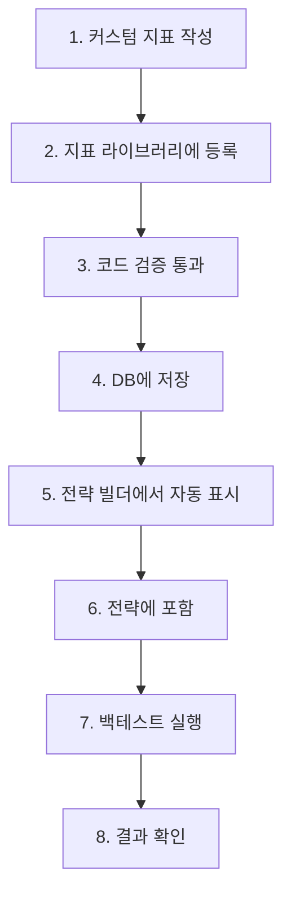

# 커스텀 지표 완전 가이드

## 🎯 개요

AlgoForge에서 커스텀 지표를 등록하고 사용하는 전체 과정을 설명합니다.

## 📋 전체 흐름



## 1️⃣ 서버 시작

### Backend API 서버
```bash
cd C:\Users\wonbbo\Workspace\Cursor\AlgoForge
python -m uvicorn apps.api.main:app --reload --port 8000
```

### Frontend 개발 서버
```bash
cd C:\Users\wonbbo\Workspace\Cursor\AlgoForge\apps\web
pnpm dev
```

## 2️⃣ 커스텀 지표 등록

### 방법 1: UI 사용 (권장)

#### Step 1: 지표 라이브러리 접속
```
http://localhost:3000/indicators
```

#### Step 2: 새 지표 등록
1. "커스텀 지표 추가" 버튼 클릭
2. 기본 정보 입력:
   - **지표 이름**: `My Custom VWAP`
   - **지표 타입**: `my_vwap` (고유 ID, 소문자+언더스코어)
   - **설명**: `Volume Weighted Average Price`
   - **카테고리**: `volume`
   - **출력 필드**: `main` (단일 출력) 또는 `main,signal,histogram` (다중 출력)
   - **파라미터 스키마**: `{"period": 20}` (JSON 형식)

#### Step 3: 코드 작성
```python
def calculate_my_vwap(df, params):
    """
    VWAP 계산
    
    Args:
        df: OHLCV DataFrame
        params: 파라미터 딕셔너리
    
    Returns:
        pd.Series: 단일 값
    """
    typical_price = (df['high'] + df['low'] + df['close']) / 3
    vwap = (typical_price * df['volume']).cumsum() / df['volume'].cumsum()
    return vwap.fillna(0)
```

#### Step 4: 검증 및 등록
1. "코드 검증" 버튼 클릭
2. ✅ "코드 검증 통과" 확인
3. "등록" 버튼 클릭

### 방법 2: API 직접 호출

```bash
curl -X POST http://localhost:8000/api/indicators/custom \
  -H "Content-Type: application/json" \
  -d '{
    "name": "My Custom VWAP",
    "type": "my_vwap",
    "description": "Volume Weighted Average Price",
    "category": "volume",
    "code": "def calculate_my_vwap(df, params):\n    typical_price = (df[\"high\"] + df[\"low\"] + df[\"close\"]) / 3\n    vwap = (typical_price * df[\"volume\"]).cumsum() / df[\"volume\"].cumsum()\n    return vwap.fillna(0)",
    "params_schema": "{\"period\": 20}",
    "output_fields": ["main"]
  }'
```

## 3️⃣ 전략 빌더에서 사용

### Step 1: 전략 빌더 접속
```
http://localhost:3000/strategies/builder
```

### Step 2: 지표 선택 (Step 1)
1. 지표 목록에서 **"My Custom VWAP"** 카드 확인
   - 🏷️ **"커스텀"** 배지 표시
   - 📊 **"1 출력"** 배지 (단일 출력인 경우)
2. **"+" 버튼** 클릭하여 추가
3. 자동으로 ID 생성: `my_vwap_1`
4. 파라미터 설정 (기본값 자동 로드)

### Step 3: 진입 조건 설정 (Step 2)
1. 롱 진입 조건 추가
2. 좌변: `price` → `close`
3. 연산자: `>`
4. 우변: `indicator` → `my_vwap_1` (커스텀 지표 참조)

### Step 4: 손절 및 Reverse 설정
- 손절: `fixed_percent` (2%) 또는 `atr_based`
- Reverse: 활성화

### Step 5: 전략 JSON 확인
```json
{
  "schema_version": "1.0",
  "meta": {
    "name": "VWAP Cross Strategy",
    "description": "커스텀 VWAP 지표 사용 전략"
  },
  "indicators": [
    {
      "id": "my_vwap_1",
      "type": "my_vwap",
      "params": {
        "period": 20
      }
    }
  ],
  "entry": {
    "long": {
      "and": [
        {
          "left": { "price": "close" },
          "op": ">",
          "right": { "ref": "my_vwap_1" }
        }
      ]
    }
  }
}
```

### Step 6: 전략 저장
1. "전략 저장" 버튼 클릭
2. 전략 목록에서 확인

## 4️⃣ 백테스트 실행

### Step 1: Run 생성
```
http://localhost:3000/runs
```
1. "새 Run 생성" 버튼 클릭
2. 데이터셋 선택
3. 전략 선택 (위에서 만든 전략)
4. "실행" 버튼 클릭

### Step 2: 자동 처리
1. **StrategyParser 초기화**
   - `_load_custom_indicators()` 호출
   - DB에서 `my_vwap` 지표 코드 로드
   - `IndicatorCalculator`에 등록

2. **지표 계산**
   - `calculate_indicator()` 호출
   - `my_vwap` 함수 실행
   - DataFrame에 `my_vwap_1` 컬럼 추가

3. **백테스트 실행**
   - 진입 조건 평가 시 `my_vwap_1` 참조
   - 정상적으로 거래 신호 생성

### Step 3: 결과 확인
- Run 상태: `COMPLETED`
- Metrics 확인
- 거래 내역 확인

## 🎨 다중 출력 지표 예시

### MACD 스타일 지표

```python
def calculate_custom_macd(df, params):
    """
    커스텀 MACD 지표
    
    Returns:
        Dict[str, pd.Series]: 3개 출력값
    """
    fast = params.get('fast', 12)
    slow = params.get('slow', 26)
    signal = params.get('signal', 9)
    
    ema_fast = df['close'].ewm(span=fast).mean()
    ema_slow = df['close'].ewm(span=slow).mean()
    macd_line = ema_fast - ema_slow
    signal_line = macd_line.ewm(span=signal).mean()
    histogram = macd_line - signal_line
    
    return {
        'main': macd_line.fillna(0),
        'signal': signal_line.fillna(0),
        'histogram': histogram.fillna(0)
    }
```

**등록 정보**:
- 출력 필드: `main,signal,histogram`

**전략에서 사용**:
```json
{
  "indicators": [
    {
      "id": "macd_1",
      "type": "custom_macd",
      "params": {"fast": 12, "slow": 26, "signal": 9}
    }
  ],
  "entry": {
    "long": {
      "and": [
        {
          "left": { "ref": "macd_1_main" },
          "op": "cross_above",
          "right": { "ref": "macd_1_signal" }
        }
      ]
    }
  }
}
```

### 볼린저 밴드 스타일 지표

```python
def calculate_custom_bb(df, params):
    """볼린저 밴드"""
    period = params.get('period', 20)
    std_dev = params.get('std_dev', 2.0)
    
    sma = df['close'].rolling(window=period).mean()
    std = df['close'].rolling(window=period).std()
    
    return {
        'main': sma.fillna(0),
        'upper': (sma + std * std_dev).fillna(0),
        'lower': (sma - std * std_dev).fillna(0)
    }
```

**등록 정보**:
- 출력 필드: `main,upper,lower`

**전략에서 사용**:
```json
{
  "entry": {
    "long": {
      "and": [
        {
          "left": { "price": "close" },
          "op": "<",
          "right": { "ref": "bb_1_lower" }
        }
      ]
    }
  }
}
```

## 🔍 문제 해결 가이드

### 증상 1: 커스텀 지표가 전략 빌더에 표시되지 않음

**원인**: TypeScript 타입 제약

**해결**: ✅ 완료됨
- `apps/web/types/strategy-draft.ts`의 `IndicatorDraft.type`을 `string`으로 변경
- 브라우저 새로고침 (Ctrl + F5)

### 증상 2: "지표 목록을 불러올 수 없습니다" 에러

**원인**: API 서버 미실행 또는 CORS 문제

**해결**:
1. API 서버 실행 확인:
   ```bash
   curl http://localhost:8000/api/indicators/
   ```
2. CORS 설정 확인:
   - `apps/api/main.py`의 `allow_origins` 확인
   - `http://localhost:3000` 포함되어 있어야 함

### 증상 3: 로딩 스피너만 계속 돌아감

**원인**: API 호출 실패

**해결**:
1. 브라우저 콘솔 (F12) 확인
2. 네트워크 탭에서 요청 확인
3. 에러 메시지 확인

### 증상 4: 파라미터 UI가 표시되지 않음

**원인**: `params_schema`가 빈 문자열 또는 잘못된 JSON

**해결**:
```bash
# DB에서 params_schema 확인
python -c "import sqlite3; conn = sqlite3.connect('db/algoforge.db'); cursor = conn.execute('SELECT type, params_schema FROM indicators WHERE type=\"my_vwap\"'); print(cursor.fetchone())"
```

## ✅ 최종 체크리스트

### Backend
- [x] indicators 테이블 생성
- [x] 마이그레이션 적용
- [x] 기본 내장 지표 4개 등록
- [x] API 엔드포인트 구현
- [x] 코드 검증기 구현
- [x] 동적 로더 구현

### Frontend
- [x] 지표 라이브러리 UI (/indicators)
- [x] 커스텀 지표 등록 UI (/indicators/new)
- [x] 지표 상세/수정 UI (/indicators/[type])
- [x] 네비게이션 메뉴 추가
- [x] API 클라이언트 구현
- [x] TypeScript 타입 정의
- [x] 전략 빌더 통합
- [x] 타입 제약 제거 ✨

### Engine
- [x] 다중 리턴값 지원
- [x] 커스텀 지표 로더
- [x] StrategyParser 통합

### 테스트
- [x] 단위 테스트 (9개)
- [x] API 테스트 (12개)
- [x] 통합 테스트 (3개)
- [x] TypeScript 컴파일 (0 에러)

## 🚀 빠른 시작 가이드

### 5분 안에 커스텀 지표 만들기

```bash
# 1. 서버 시작
cd C:\Users\wonbbo\Workspace\Cursor\AlgoForge
start_api_server.bat  # 또는 python -m uvicorn ...

# 새 터미널
cd apps/web
pnpm dev

# 2. 브라우저 열기
# http://localhost:3000/indicators/new

# 3. 정보 입력 후 등록

# 4. 전략 빌더에서 확인
# http://localhost:3000/strategies/builder
```

## 📊 등록된 지표 확인

### CLI로 확인
```bash
cd C:\Users\wonbbo\Workspace\Cursor\AlgoForge
python -c "import sqlite3; conn = sqlite3.connect('db/algoforge.db'); cursor = conn.execute('SELECT name, type, implementation_type FROM indicators'); [print(f\"{row[0]:20s} | {row[1]:20s} | {row[2]}\") for row in cursor.fetchall()]"
```

### API로 확인
```bash
curl http://localhost:8000/api/indicators/
```

### UI로 확인
```
http://localhost:3000/indicators
```

## 💡 팁 & 트릭

### 지표 코드 작성 팁

#### 1. pandas 메서드 활용
```python
# Rolling mean
df['close'].rolling(window=period).mean()

# EWM (지수 가중 이동평균)
df['close'].ewm(span=period).mean()

# Shift (이전 값)
df['close'].shift(1)
```

#### 2. NaN 처리
```python
# 0으로 채우기
return result.fillna(0)

# Forward fill
return result.ffill()

# Backward fill
return result.bfill()
```

#### 3. 조건부 계산
```python
# 볼륨이 평균보다 높을 때만
vol_avg = df['volume'].rolling(window=20).mean()
high_vol = df['volume'] > vol_avg
return high_vol.astype(float)  # True/False → 1.0/0.0
```

### 파라미터 스키마 예시

```json
{
  "period": 20,
  "source": "close",
  "multiplier": 2.0,
  "threshold": 50
}
```

### 출력 필드 명명 규칙

- **단일 출력**: `main`
- **다중 출력**: `main,signal,histogram` 또는 `upper,middle,lower`

## 🎓 고급 예시

### 예시 1: 볼륨 프로파일 지표

```python
def calculate_volume_profile(df, params):
    """볼륨과 볼륨 EMA 비교"""
    ema_period = params.get('ema_period', 20)
    
    vol_ema = df['volume'].ewm(span=ema_period).mean()
    vol_position = (df['volume'] > vol_ema).astype(float)
    
    return {
        'main': df['volume'],
        'ema': vol_ema,
        'position': vol_position  # 1.0 (위) / 0.0 (아래)
    }
```

### 예시 2: 가격 모멘텀 지표

```python
def calculate_momentum(df, params):
    """N봉 전 대비 가격 변화율"""
    lookback = params.get('lookback', 14)
    
    momentum = (df['close'] - df['close'].shift(lookback)) / df['close'].shift(lookback) * 100
    return momentum.fillna(0)
```

### 예시 3: 복합 지표

```python
def calculate_composite(df, params):
    """여러 지표를 조합"""
    fast = params.get('fast', 12)
    slow = params.get('slow', 26)
    
    ema_fast = df['close'].ewm(span=fast).mean()
    ema_slow = df['close'].ewm(span=slow).mean()
    
    # 크로스오버 강도
    diff = ema_fast - ema_slow
    diff_pct = diff / df['close'] * 100
    
    return {
        'main': diff,
        'percentage': diff_pct
    }
```

## 📈 성능 고려사항

### 최적화 팁
1. **벡터화 연산 사용** - pandas 메서드 활용
2. **불필요한 반복 피하기** - for 루프 대신 벡터 연산
3. **메모리 효율** - 큰 중간 변수 생성 피하기

### 주의사항
⚠️ **결정성 보장** - 난수 사용 금지  
⚠️ **시간 의존 금지** - `datetime.now()` 사용 금지  
⚠️ **외부 API 호출 금지** - 네트워크 요청 불가  

## 🎉 완료!

이제 다음이 가능합니다:

✅ 웹 UI에서 커스텀 지표 등록  
✅ 전략 빌더에서 커스텀 지표 선택  
✅ 백테스트 실행 시 자동 로드  
✅ 다중 출력 지표 지원  
✅ 실시간 코드 검증  

---

**문서 버전**: 1.0  
**최종 수정**: 2025-12-13  
**상태**: 완료 ✅

